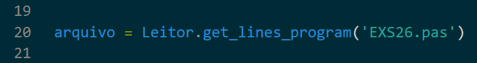

# Analisador-Pascal

## Descrição do Projeto
O projeto se propõe à construir um Interpretador da linguagem Pascal([Especificações](https://github.com/juliarezende34/Analisador-Pascal/blob/main/Especifica%C3%A7%C3%B5es/Analisador_L%C3%A9xico.pdf)). Acompanhe o status do projeto abaixo:

- [X] Análise Léxica
- [ ] Análise Sintática
- [ ] Análise Semântica
- [ ] Interpretação e execução

## Execução de Código
Utilizando Python 3.12.3 para interpretar o programa, execute:

```powershell
py .\main.py .\inputs
```


Atenção para escolher o arquivo de entrada em Pascal que queira ser lido, vá até a linha _*20*_ do arquivo `main.py` e altere para o nome do arquivo que deseja rodar.




## Documentação de Código
O código escrito segue padrões de documentação estabelecidos peas PEPs[PEPs]. Desta forma o linter Flake8[#FK8] assistiu o desenvolvimento do projeto.

## PEPs
Em função de garantir uma consistência estilística ao se escrever um código, elaboraram-se as PEPs(Python Enhancement Proposals). À priori, as PEPs propõem que a comunidade escreva seu código seguindo determinados padrões, de modo que qualquer código em Python possa se parecer e ter sua compreensão facilitada. Em síntese, problemas como a falta de caráter declarativo do Python por ser uma linguagem dinâmicamente tipada são resolvidos. Acompanhe o exemplo abaixo para entender melhor:

- PEP 484, PEP 585, PEP 604 e a proposição de Type Hints
```python
def calcular_imposto(valor: float, taxa: float) -> float:
    """Retorna o valor do imposto."""  
    return valor * taxa
 ```
# Referencial
<!-- PEPs -->[PEPs] https://peps.python.org/#introduction
<br>
<!-- Flake8 -->[FK8] - https://flake8.pycqa.org/en/latest/


## Desenvolvido por:

_[Lucas Lima](https://www.linkedin.com/in/lucas-lima-358599223/)_

_[Julia Rezende](https://www.linkedin.com/in/julia-rezende-r28/)_

_[Mariana Rodrigues](https://www.linkedin.com/in/mariana-rodrigues-lmelo/)_

_[João Gustavo](https://www.linkedin.com/in/joao-gustavo-silva/)_


